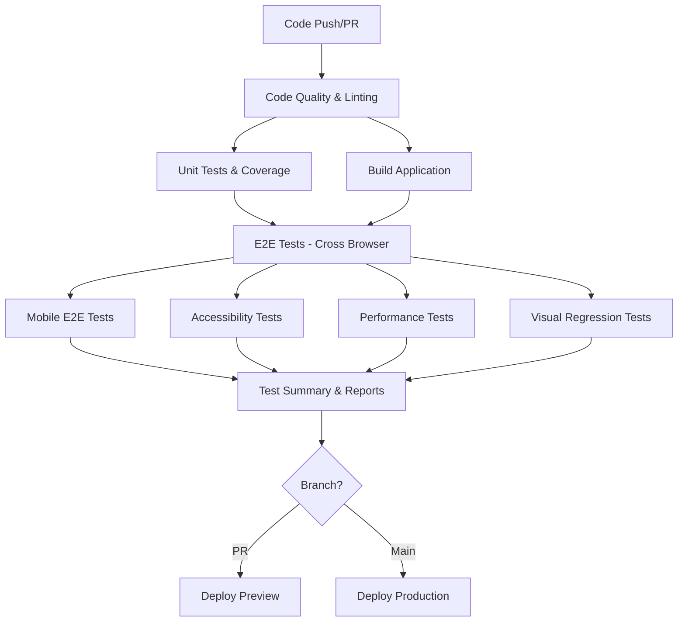

# 🚀 CI/CD Testing Pipeline Setup

This document outlines the comprehensive CI/CD testing pipeline configured for the Jarvis UI Studio project.

## 📋 Overview

The CI/CD pipeline implements a multi-stage testing strategy that ensures code quality, performance, accessibility, and security standards are met before deployment. The pipeline runs automatically on pull requests and main branch pushes.

## 🏗️ Pipeline Architecture

### Workflow Files

- **`ui-studio-ci.yml`** - Main CI/CD pipeline for PR and main branch testing
- **`ui-studio-nightly.yml`** - Comprehensive nightly testing across browsers and devices
- **`ui-studio-performance-monitor.yml`** - Continuous performance monitoring and regression detection

### Pipeline Stages



## 🧪 Testing Strategy

### 1. Code Quality & Linting
- **TypeScript compilation** - Ensures type safety
- **ESLint** - Code quality and consistency
- **Brand compliance** - Ensures design system adherence
- **Timeout**: 10 minutes

### 2. Unit Tests & Coverage
- **Framework**: Vitest with React Testing Library
- **Coverage Requirements**: 80% minimum (lines, functions, branches, statements)
- **Reporters**: JSON, JUnit, Cobertura for CI integration
- **Timeout**: 15 minutes

### 3. Cross-Browser E2E Tests
- **Browsers**: Chromium, Firefox, WebKit
- **Framework**: Playwright
- **Parallel Execution**: Matrix strategy for efficiency
- **Retry Logic**: 2 retries on CI failures
- **Timeout**: 30 minutes per browser

### 4. Mobile E2E Tests
- **Devices**: Mobile Chrome, Mobile Safari
- **Viewports**: Responsive testing across device sizes
- **Touch Interactions**: Gesture and touch-specific testing
- **Timeout**: 25 minutes

### 5. Accessibility Testing
- **Standards**: WCAG 2.1 AA compliance
- **Framework**: @axe-core/playwright
- **Coverage**: All pages and interactive elements
- **Zero Tolerance**: No accessibility violations allowed
- **Timeout**: 20 minutes

### 6. Performance Testing
- **Lighthouse Audits**: Core Web Vitals monitoring
- **Bundle Size Analysis**: Size limit enforcement
- **Load Time Monitoring**: Performance regression detection
- **Thresholds**: 85% Lighthouse score minimum
- **Timeout**: 25 minutes

### 7. Visual Regression Testing
- **Screenshots**: Pixel-perfect visual comparisons
- **Consistent Environment**: Fixed viewport and browser settings
- **Baseline Management**: Automated baseline updates
- **Timeout**: 20 minutes

## 📊 Reporting & Artifacts

### Test Reports Generated

1. **Unit Test Coverage**
   - HTML coverage report
   - Cobertura XML for PR comments
   - JSON summary for automation

2. **E2E Test Results**
   - Playwright HTML reports
   - JUnit XML for CI integration
   - Video recordings on failures
   - Screenshots on failures

3. **Performance Reports**
   - Lighthouse JSON reports
   - Bundle size analysis
   - Performance trend data

4. **Accessibility Reports**
   - WCAG violation details
   - Accessibility coverage metrics
   - Remediation recommendations

5. **Consolidated Dashboard**
   - Interactive HTML dashboard
   - Markdown summary for PRs
   - JSON data for external tools

### Artifact Retention

- **Test Results**: 30 days
- **Coverage Reports**: 30 days
- **Performance Data**: 90 days
- **Nightly Reports**: 7 days
- **Build Artifacts**: 30 days

## 🔒 Quality Gates & Branch Protection

### Required Status Checks
All PRs must pass these checks before merging:

- Code Quality & Linting ✅
- Unit Tests & Coverage ✅
- Build Application ✅
- E2E Tests (all browsers) ✅
- Mobile E2E Tests ✅
- Accessibility Tests ✅
- Performance Tests ✅
- Visual Regression Tests ✅

### Coverage Requirements
- **Minimum Line Coverage**: 80%
- **Minimum Function Coverage**: 80%
- **Minimum Branch Coverage**: 80%
- **Minimum Statement Coverage**: 80%

### Performance Requirements
- **Lighthouse Score**: ≥85%
- **First Contentful Paint**: ≤2000ms
- **Largest Contentful Paint**: ≤2500ms
- **Cumulative Layout Shift**: ≤0.1
- **Total Blocking Time**: ≤300ms

### Bundle Size Limits
- **Main Bundle**: ≤512KB
- **Vendor Bundle**: ≤1MB
- **Total Bundle**: ≤1.5MB
- **Individual Chunks**: ≤256KB
- **Total Gzipped**: ≤512KB

## 🌙 Nightly Testing

### Comprehensive Test Suite
Runs nightly to catch regressions and maintain quality:

- **Cross-browser compatibility** - All major browsers
- **Performance baselines** - Track performance trends
- **Stress testing** - Memory leaks and heavy load scenarios
- **Visual regression** - Comprehensive screenshot comparison
- **Accessibility compliance** - Full WCAG audit

### Failure Handling
- **Automatic Issue Creation** - GitHub issues created for failures
- **Slack Notifications** - Team alerts for critical failures
- **Trend Analysis** - Performance regression detection

## 📈 Performance Monitoring

### Continuous Monitoring
Runs every 6 hours to track performance:

- **Lighthouse Audits** - Core Web Vitals tracking
- **Bundle Analysis** - Size trend monitoring
- **Load Time Monitoring** - Geographic performance testing
- **Runtime Performance** - CPU and memory profiling

### Regression Detection
- **Automated Alerts** - Performance degradation notifications
- **Trend Analysis** - Historical performance comparison
- **Issue Creation** - Automatic GitHub issues for regressions

## 🚀 Deployment Strategy

### Preview Deployments
- **Automatic PR Deployments** - Vercel preview environments
- **Environment Isolation** - Separate preview per PR
- **Automatic Updates** - Re-deploy on new commits

### Production Deployments
- **Main Branch Only** - Only main/master branch deploys
- **Quality Gate Enforcement** - All tests must pass
- **Manual Approval** - Production environment protection
- **Zero-downtime** - Blue-green deployment strategy

## 🔧 Configuration Files

### Key Configuration Files
- **`.lighthouserc.js`** - Lighthouse CI configuration
- **`vitest.config.ts`** - Unit test configuration
- **`playwright.config.ts`** - E2E test configuration
- **`.github/branch-protection.json`** - Branch protection rules

### Environment Variables
Required secrets for full functionality:

```bash
# Deployment
VERCEL_TOKEN=<vercel-deployment-token>
VERCEL_ORG_ID=<vercel-organization-id>
VERCEL_PROJECT_ID=<vercel-project-id>

# Code Coverage
CODECOV_TOKEN=<codecov-upload-token>

# Performance Monitoring
LHCI_GITHUB_APP_TOKEN=<lighthouse-ci-token>
DASHBOARD_WEBHOOK_URL=<performance-dashboard-webhook>
DASHBOARD_TOKEN=<dashboard-auth-token>

# Optional: External Monitoring
METRICS_STORAGE_TOKEN=<metrics-storage-token>
```

## 📚 Scripts Reference

### Test Execution Scripts
```bash
# Unit Tests
npm run test              # Run tests in watch mode
npm run test:run          # Run tests once
npm run test:coverage     # Run tests with coverage
npm run test:ui           # Run tests with UI

# E2E Tests
npm run test:e2e          # Run all E2E tests
npm run test:e2e:ui       # Run E2E tests with UI
npm run test:e2e:headed   # Run E2E tests in headed mode
npm run test:e2e:debug    # Run E2E tests in debug mode

# Browser-specific E2E Tests
npm run test:e2e:chromium # Chromium only
npm run test:e2e:firefox  # Firefox only
npm run test:e2e:webkit   # WebKit only

# Specialized Testing
npm run test:e2e:mobile   # Mobile device testing
npm run test:e2e:accessibility # Accessibility testing
npm run test:e2e:performance   # Performance testing
npm run test:e2e:visual        # Visual regression testing

# Reporting
npm run test:e2e:report   # View E2E test reports
npm run test:e2e:summary  # Generate test summary
```

### Validation Scripts
```bash
# Setup Validation
npm run test:e2e:validate # Validate E2E setup

# Bundle Analysis
npm run build             # Build for production
node scripts/check-bundle-size.js # Check bundle sizes

# Brand Compliance
npm run brand-check       # Check brand compliance
npm run brand-check:strict # Strict compliance check
```

## 🐛 Troubleshooting

### Common Issues

1. **Tests Failing in CI but Passing Locally**
   - Check environment variables
   - Verify browser installation
   - Review CI-specific configurations

2. **Coverage Below Threshold**
   - Add tests for uncovered code
   - Review coverage exclusions
   - Check test file patterns

3. **E2E Tests Timing Out**
   - Increase timeout values
   - Check for anti-patterns in tests
   - Review network conditions

4. **Performance Tests Failing**
   - Check bundle size increases
   - Review Lighthouse thresholds
   - Analyze performance metrics

5. **Visual Regression Failures**
   - Review screenshot differences
   - Update visual baselines if needed
   - Check for dynamic content

### Debug Commands
```bash
# Run tests with verbose output
npm run test:run -- --reporter=verbose

# Run E2E tests with debug info
npm run test:e2e:debug

# Validate complete setup
npm run test:e2e:validate

# Check bundle sizes locally
npm run build && node scripts/check-bundle-size.js
```

## 📞 Support

For issues with the CI/CD pipeline:

1. Check the [GitHub Actions logs](../../actions)
2. Review the generated test reports
3. Run validation scripts locally
4. Check configuration files for syntax errors
5. Verify all required secrets are configured

The pipeline is designed to provide comprehensive feedback and detailed error messages to help diagnose and fix issues quickly.